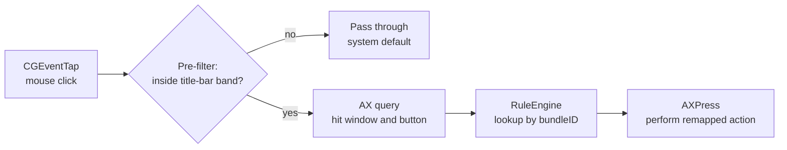

# Blinker

[简体中文](README.md) | English

A native macOS menu bar utility that remaps the window traffic-light buttons
per application (e.g. red = quit the app, green = maximize) and enlarges them
on hover so they are easier to see and click. Rules only apply to apps you
add; everything else keeps system defaults.

⬇️ **Download**: <https://github.com/ygnstudio/Blinker/releases>
(`Blinker-vX.Y.Z.dmg` — mount and drag to `/Applications`)

🍺 **Homebrew**: `brew install --cask ygnstudio/ygn/blinker` (see
[homebrew-ygn](https://github.com/ygnstudio/homebrew-ygn))

## Features

- **Per-app remapping**: each of the three buttons maps to any of 17 actions —
  close window, quit app, minimize, hide app, maximize, almost maximize,
  fullscreen, four half-screen tiles, four quarter-screen tiles, center,
  move to next display, or none (swallow the click).
- **Click-variant matrix**: beyond a plain left click, each button can also
  define its own action for right click, ⌥+click, 🌐+click and long press —
  e.g. red = quit, green = tile left, ⌥+green = quarter tile. Unconfigured
  variants keep the system default.
- **Window management**: a dedicated settings page. **Instant actions** tile
  or place the frontmost window with one click; **drag to snap** shows a
  preview as you drag a window to a screen edge or corner, snapping on
  release (halves, top-edge maximize, corner quarters); **global hotkeys**
  (default ⌃⌥ with arrows and U/I/J/K) work under any app and are fully
  rebindable.
- **Hover enlargement**: two modes. **Overlay** draws enlarged Liquid Glass
  buttons with a mis-click dwell ring (0–800 ms; brushing past never
  triggers). **Hotspot** keeps the title bar's original look and only
  enlarges the invisible click zones, responding immediately.
- **Native-button mask**: while enlarged, the real buttons are covered.
  Default is a zero-permission **Liquid Glass**; optional **Sampled** mode
  captures a clean strip of the title bar and stretches it across the mask
  so the backdrop is pixel-identical (needs Screen Recording permission;
  falls back to glass automatically).
- **Never out of bounds**: the enlarged panel is laid out as a whole group
  and clamped to the intersection of the window and the screen.
- **App library picker**: adding an app lists every installed app with
  search — no need to launch it first.
- **Useful without rules**: with no rule, an enlarged click still performs
  the button's native action.
- **Local only**: no network requests, no analytics, no telemetry.

## Requirements

- macOS 15 or later, Apple Silicon and Intel.
- **Accessibility** permission (System Settings → Privacy & Security →
  Accessibility) to read and rewrite other apps' window buttons. All
  processing is local.

## How it works

Click interception is a **cheap pre-filter + on-demand AX query** — most
clicks die in the first step and never reach the Accessibility APIs:



- **Interception**: the CGEventTap thread only does coordinate-level
  filtering; AX queries and actions run on a serial worker queue.
- **Hover enlargement**: entering the trigger zone (button group + 12 pt)
  lays the native-button mask first, then the enlarged chips; all geometry
  is clamped to window ∩ screen in global coordinates.
- **Backdrop sampling**: ScreenCaptureKit captures strips beside the
  buttons → per-column cleanliness analysis (rejects text, buttons, and
  transparent pixels) → the widest clean run is stretched across the mask.

## Known limitations

- Secure Input (e.g. password fields) temporarily disables event
  interception; buttons fall back to system behavior.
- Apps with fully custom title bars (some Electron apps) expose no standard
  accessibility buttons and cannot be intercepted.

## Build from source

```bash
git clone https://github.com/ygnstudio/Blinker.git
cd Blinker
./Scripts/build-app.sh   # produces Blinker.app
open Blinker.app
```

Or run the tests:

```bash
swift test
```

## Documentation

- [Architecture](docs/ARCHITECTURE.md) — module map, data flows, threading model
- [Contributing](CONTRIBUTING.md) — build instructions, codebase tour, common tasks
- [Changelog](CHANGELOG.md)
- [Code of Conduct](CODE_OF_CONDUCT.md)

## License

MIT — see [LICENSE](LICENSE).
