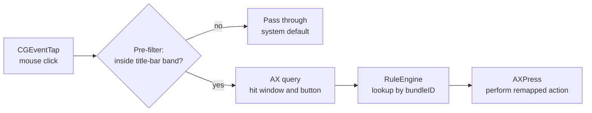

# Blinker

[简体中文](README.md) | English

A native macOS menu bar utility that remaps the window traffic-light buttons
per application (e.g. red = quit the app, green = maximize) and enlarges them
on hover so they are easier to see and click. Rules only apply to apps you
add; everything else keeps system defaults.

⬇️ **Download**: <https://github.com/ygnstudio/Blinker/releases>
(`Blinker-vX.Y.Z.dmg` — mount and drag to `/Applications`)

🍺 **Homebrew**: `brew install --cask ygnstudio/ygn/blinker` (see
[homebrew-ygn](https://github.com/ygnstudio/homebrew-ygn))

## Features

- **Per-app remapping**: each of the three buttons maps to any of 17 actions —
  close window, quit app, minimize, hide app, maximize, almost maximize,
  fullscreen, four half-screen tiles, four quarter-screen tiles, center,
  move to next display, or none (swallow the click).
- **Click-variant matrix**: beyond a plain left click, each button can also
  define its own action for right click, ⌥+click, 🌐+click and long press —
  e.g. red = quit, green = tile left, ⌥+green = quarter tile. Unconfigured
  variants keep the system default.
- **Workspaces & desktop switching**: save the current window arrangement
  as a named workspace and restore it in one click (settings page or the
  hover chip); switch macOS desktops via the simulated ⌃←/⌃→ shortcut.
- **Window management**: hover the traffic lights and click the
  window-manager chip — a compact placement grid plus one-tap workspace
  restore, always acting on the hovered window. Settings additionally offer
  **drag to snap** (edge/corner preview, snapping on release) and **global
  hotkeys** (default ⌃⌥ with arrows and U/I/J/K, fully rebindable).
- **Hover enlargement**: native AppKit buttons enlarge over the original traffic
  lights, with a configurable dwell gate (0–800 ms). Move away to dismiss.
- **Native glass**: one nonactivating panel hosts native Liquid Glass buttons
  over the original traffic lights, grouped in a shared glass effect container. No screenshot sampling,
  Screen Recording permission, painted glows, or delayed material fade.
- **Separate windows**: app rules have a dedicated list window, and each app
  opens its own editor. Preferences live in a separate settings window.
- **Never out of bounds**: the enlarged panel is laid out as a whole group
  and clamped to the screen; it can extend over the target window’s edge to stay aligned.
- **App library picker**: adding an app lists every installed app with
  search — no need to launch it first.
- **Useful without rules**: with no rule, an enlarged click still performs
  the button's native action.
- **Local only**: no network requests, no analytics, no telemetry.

## Requirements

- macOS 15 or later, Apple Silicon and Intel.
- **Accessibility** permission (System Settings → Privacy & Security →
  Accessibility) to read and rewrite other apps' window buttons. All
  processing is local.

## How it works

Click interception is a **cheap pre-filter + on-demand AX query** — most
clicks die in the first step and never reach the Accessibility APIs:


```mermaid
flowchart LR
    A[CGEventTap<br>mouse click] --> B{Pre-filter:<br>inside title-bar band?}
    B -->|no| Z[Pass through<br>system default]
    B -->|yes| C[AX query<br>hit window and button]
    C --> D[RuleEngine<br>lookup by bundleID]
    D --> E[AXPress<br>perform remapped action]
```

- **Interception**: the CGEventTap thread only does coordinate-level
  filtering; AX queries and actions run on a serial worker queue.
- **Hover enlargement**: entering the trigger zone (button group + 12 pt)
  groups native glass buttons in one effect container; all geometry is
  clamped to window ∩ screen in global coordinates.

## Known limitations

- Secure Input (e.g. password fields) temporarily disables event
  interception; buttons fall back to system behavior.
- Apps with fully custom title bars (some Electron apps) expose no standard
  accessibility buttons and cannot be intercepted.

## Accessibility breaks after an upgrade?

Blinker ships ad-hoc signed (no paid developer account). macOS pins the
Accessibility grant to one specific code signature, so **after every upgrade
the toggle in System Settings still reads ON while the new build has been
silently denied** — interception and hover enlargement stop working. Fix:

```bash
tccutil reset Accessibility com.ygnstudio.Blinker
```

Then relaunch Blinker and grant Accessibility again when prompted. Applies to
both Homebrew upgrades and manually replacing the app.

## Build from source

```bash
git clone https://github.com/ygnstudio/Blinker.git
cd Blinker
./Scripts/build-app.sh   # installs to ~/Applications/Blinker.app
open ~/Applications/Blinker.app
```

Or run the tests:

```bash
swift test
```

## Documentation

- [Architecture](docs/ARCHITECTURE.md) — module map, data flows, threading model
- [Contributing](CONTRIBUTING.md) — build instructions, codebase tour, common tasks
- [Changelog](CHANGELOG.md)
- [Code of Conduct](CODE_OF_CONDUCT.md)

## License

MIT — see [LICENSE](LICENSE).
