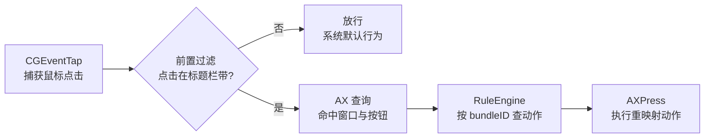

# Blinker

简体中文 | [English](README.en.md)

macOS 菜单栏小工具：按应用重定义窗口红绿灯按钮的行为（如红灯 = 退出应用、绿灯 = 最大化），悬停时按钮放大，更容易看清和点击。规则只对你添加的应用生效，其余保持系统默认。

⬇️ **下载地址**：<https://github.com/ygnstudio/Blinker/releases>（`Blinker-vX.Y.Z.dmg`，挂载后拖入 `/Applications`）

🍺 **Homebrew**：`brew install --cask ygnstudio/ygn/blinker`（见 [homebrew-ygn](https://github.com/ygnstudio/homebrew-ygn)）

## 功能特性

- **按应用重映射**：红 / 黄 / 绿三颗灯各自映射 17 种动作——关闭窗口、退出应用、最小化、隐藏应用、最大化、准最大化、全屏、四向半屏、四向四分屏、窗口居中、移到下一显示器、无操作（吞掉点击）。
- **点击方式矩阵**：每颗灯除普通左键外，还可单独定义右键、⌥+左键、🌐+左键和长按左键的动作，组合出红=退出、绿=左半屏、⌥+绿=四分屏等玩法；未配置的点击方式保持系统默认。
- **场景规则集**：把整套规则存成命名预设（工作 / 会议 / 个人…），菜单栏或规则页一键整体切换，不同场景下红绿灯行为各就各位；老配置自动迁移为「默认」规则集。
- **窗口管理**：设置内独立页面。**即时操作面板**对最前面的窗口一键执行任意摆放动作；**拖拽贴靠**按住窗口拖到屏幕边缘/角落出现预览框，松手即贴靠（左右半屏、上边缘最大化、四角四分屏）；**全局快捷键**默认 ⌃⌥ + 方向键与 U/I/J/K，可录制改绑，任意应用下直接生效。
- **悬停放大**：两种模式。**覆盖放大**绘制液态玻璃大按钮，带防误触进度环（0–800 ms 可调，环填满才响应，路过不误触）；**纯热区**保持标题栏原样，只扩大不可见点击区，点击立即响应。
- **原生按钮遮挡**：放大时原生按钮被遮罩挡住。默认**液态玻璃**零权限；可选**真实采样**——抓取标题栏干净背景逐列分析后拉伸铺底，视觉上无痕（需屏幕录制权限，无权限或无干净区域自动回退玻璃）。
- **不越界**：放大面板整组布局并钳制在「窗口 ∩ 屏幕」内，全屏、贴边窗口都不超出。
- **应用库选择**：添加应用时列出全部已安装应用（支持搜索），不必先启动应用。
- **未配置规则也有用**：无规则时，放大的点击仍执行按钮原生动作。
- **本地运行**：无网络请求、无数据收集、无统计。

## 运行要求

- macOS 15 及以上，Apple Silicon 与 Intel。
- **辅助功能**权限（系统设置 → 隐私与安全性 → 辅助功能），用于读取并改写其他应用窗口的按钮。所有处理均在本地完成。

## 目录结构

```
Blinker/
├── Package.swift
├── Scripts/
│   ├── build-app.sh                # 本地一键打包（产出 Blinker.app）
│   └── package-app.sh              # CI 打包（版本号注入 + 签名）
├── Sources/
│   ├── BlinkerCore/                # 无 UI 的核心逻辑（可独立测试）
│   │   ├── AXInterceptor/          #   CGEventTap 拦截 + AX 查询 + 动作执行
│   │   ├── RuleEngine/             #   按应用动作映射 + 场景规则集
│   │   ├── HoverOverlay/           #   悬停放大覆盖层（芯片 / 遮罩 / 背景采样）
│   │   ├── Models/                 #   AppRule / ButtonAction / TrafficButton
│   │   └── Permission/             #   辅助功能权限检测
│   └── BlinkerApp/                 # SwiftUI 应用壳（菜单栏 + 设置窗口）
├── Tests/BlinkerCoreTests/         # 单元测试（64 个）
├── docs/
│   ├── ARCHITECTURE.md             # 架构说明（模块地图 / 数据流 / 线程模型）
│   └── design/                     # 早期设计稿
└── .github/workflows/
    ├── ci.yml                      # build + test + lint（strict）
    └── release.yml                 # tag 触发：构建 → DMG → 发布 Release
```

## 工作原理

点击拦截是**便宜前置过滤 + 按需 AX 查询**，绝大多数点击在第一步就被丢弃，不会产生辅助功能调用：



- **拦截**：CGEventTap 独立线程只做坐标级过滤；AX 查询与动作执行走串行工作队列，不阻塞 tap。
- **悬停放大**：光标进入按钮组外扩 12pt 的触发区后，先铺原生按钮遮罩，再铺放大芯片；坐标统一换算到屏幕全局坐标，布局钳制在窗口与屏幕交集内。
- **背景采样**：ScreenCaptureKit 抓取按钮两侧条带 → 逐列分析干净度（排除文字 / 按钮 / 透明像素）→ 最宽干净段拉伸铺底；找不到干净段时用参考色纯色兜底。

## 使用方式

1. 点击菜单栏图标打开设置窗口（**规则 / 悬停放大 / 关于** 三个 tab）。
2. 在**规则** tab 添加应用（应用库选择器），为红 / 黄 / 绿灯选择动作。
3. 在**悬停放大** tab 选择模式与尺寸，需要无痕背景时切换到「真实采样」。
4. 首次启动按提示授予辅助功能权限，之后悬停即见放大效果。

| 操作 | 行为 |
|------|------|
| 左键菜单栏图标 | 打开设置窗口 |
| 悬停红绿灯 | 按钮放大（触发区内生效） |
| 点击放大按钮 | 执行重映射后的动作 |

## 已知限制

- 安全输入激活时（如密码框）事件拦截临时失效，按钮回退系统行为。
- 完全自绘标题栏的应用（部分 Electron 应用）无标准辅助功能按钮，无法拦截。

## 从源码构建

```bash
git clone https://github.com/ygnstudio/Blinker.git
cd Blinker
./Scripts/build-app.sh   # 产出 Blinker.app
open Blinker.app
```

或运行测试：

```bash
swift test
```

## 文档

- [架构说明](docs/ARCHITECTURE.md) — 模块地图、数据流、线程模型
- [参与贡献](CONTRIBUTING.md) — 构建方式、代码导览、常见任务指南
- [更新日志](CHANGELOG.md)
- [行为准则](CODE_OF_CONDUCT.md)

## License

MIT —— 详见 [LICENSE](LICENSE)。
