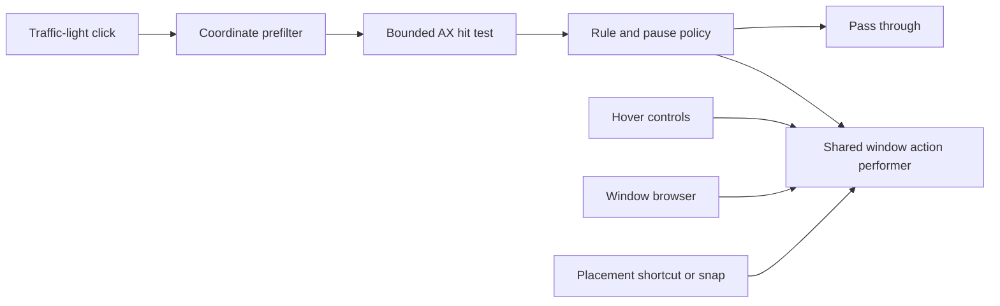

# Architecture

Blinker has two production Swift Package targets: `BlinkerCore` owns rules and native window behavior; `BlinkerApp` owns application lifecycle, preferences and presentation. Core does not depend on the app target. It includes AppKit panels where native tracking, focus and glass composition are part of the behavior.

## Ownership

| Area | Responsibility |
|---|---|
| `BlinkerCore/Models` | Persisted rule/action value types and compatible decoding |
| `BlinkerCore/RuleEngine` | Rule lookup, independent remap/hover policies, session pause, transfer and undo |
| `BlinkerCore/AXInterceptor` | Input filtering, AX queries, shared window actions, layout history, optional snapping and workspaces |
| `BlinkerCore/HoverOverlay` | Hover detection, geometry, click protection, presentation state and native controls |
| `BlinkerCore/WindowBrowser` | Window/tab identity, discovery, focus/Dock observation, thumbnails and preview geometry |
| `BlinkerCore/DesktopVisibility` and `BlinkerCore/DockClick` | Bounded window minimization, owned restore batches and optional Dock click observation |
| `BlinkerCore/Permission` | Accessibility status, read-only compatibility checks and explicit test-window registration |
| `BlinkerApp/ApplicationRules` | Application library, rule list, rule editor and rule file UI |
| `BlinkerApp/Settings` | Global settings, centralized shortcut editing, experimental workspace UI and the separate About view |
| `BlinkerApp/Permissions` | Shared authorization state, explicit requests, system-settings links and the current-app drag assistant |
| `BlinkerApp/WindowBrowser` | Browser preferences, Option-Tab handling and SwiftUI preview content |
| `BlinkerApp/WindowManagement` | Layout/hover/desktop shortcuts and recording, plus Dock and desktop action coordination |
| `BlinkerApp/MenuBar` and `BlinkerApp/Audio` | Status monitoring, configurable icons and panel, and serialized system-audio controls |
| `BlinkerApp/ScreenEffects` | Duo preferences, lid-angle reading, gesture state, display capture and image processing |
| `BlinkerApp/AppWindowController` | Shared lifecycle for native settings, About, rule-list and per-app editor windows |
| Other `BlinkerApp` controllers | Menu bar, interception coordination and failure feedback |

Rules answer “what should happen for this app?” Settings answer “how should Blinker behave globally?” The rule list owns global import/export; each app editor owns actions, independent enable flags, copy and reset. About is a separate window for product identity, version, project links and licensing. Help commands open the guide, onboarding and diagnostic tools.

Settings has eight destinations: General, Menu Bar, Screen Effects, Hover Buttons, Previews & Switching, Window Management, Shortcuts, and Privacy and Permissions. Each preference has one editor. Contextual links may reveal its owner or the shared permission assistant. Workspace controls stay inside Window Management behind their experimental enable flag; About and diagnostics are not settings categories. `SettingsNavigation` routes every settings entry point to the same window. Keep persisted preference keys, rule identities and migration readers independent of navigation labels.

## Execution boundaries

| Context | Work | Constraints |
|---|---|---|
| Event-tap thread | Coordinate filtering and synchronous bounded AX hit testing | Must decide whether to consume input; no capture, disk I/O or unbounded discovery |
| Serial AX workers | Hover/window discovery and action execution | AX messaging timeouts, bounded traversal and retained target identities |
| Main thread / `MainActor` | AppKit/SwiftUI state, panels, preferences and permission UI | UI updates only; consume worker results rather than scanning during view rendering |
| Thumbnail task | Asynchronous ScreenCaptureKit requests | One batch in flight; session checks before publishing results |
| Serial lid-sensor queue | Synchronous HID reports and device cleanup | One read in flight; at most one pending refresh, timeout and retry backoff |
| Duo capture queue and GPU | Deliver screen frames to a bounded mailbox; render through Core Image and Metal | Main-actor presentation, one latest input frame, at most two GPU commands in flight |
| Settings preview queue | Render a generated sample with the shared Duo processor | Coalesce pending requests; never capture the desktop for a settings preview |

Click hit testing is partly synchronous because the original event must be passed through or consumed before the callback returns. Do not describe the tap as AX-free. Actions execute on a worker queue; the shared performer serializes mutations. An AX timeout limits an individual call, not the sum of every call in a traversal.

Hover movement is coalesced to at most 60 detection passes per second. Discovery uses a serial worker; AppKit mutations return to the main thread. `OverlayPresentationState` protects pending/displayed state with a lock and invalidates stale detections with a revision. Appearance delay (`OverlayWakeGate`) and click protection (`OverlayClickGate`/dwell controls) remain separate policies.

## Input to action

An unconfigured ordinary left click keeps the native action. Unconfigured right, Option and Fn clicks pass through on native controls and do nothing on hover controls. A press without a configured long-press action follows the ordinary-left-click path; native interception currently also requires a configured left-click action to recognize an independent long press. Explicit `ButtonAction.none` consumes a configured click. Keep these distinctions in editor labels and help text. Per-app `isEnabled` controls remapping and `isHoverEnabled` controls enlargement independently. Session pauses override both without rewriting saved preferences. Pausing globally suspends hotkeys while preserving their saved enabled state.

Individual window-action entry points use `DefaultWindowActionPerformer.shared`. Action targets retain a PID and AX element; neither window title nor current rectangle is an identity. Screenshot matching is separate and cannot redirect an action. Failures are reported through `ActionFeedback` to a transient nonactivating panel; General shows diagnostics when module issues or recent feedback exist. Persistent diagnostic entry points live in Help. An accepted Quit request still allows the target app to ask about unsaved changes.

`HotkeyManager.BindingTarget` keeps desktop and hover commands separate from `ButtonAction`. Each has its own persisted optional binding and stable Carbon registration identity; an explicit JSON `null` means cleared, while a missing key receives the default. The desktop default is Control-Option-D. All three shortcut categories share enable, pause, conflict and retry handling. Recording temporarily releases their registrations, restores them on completion or cancellation, and does not dispatch actions while active.

`DesktopActionsCoordinator` joins permission, global pause and the opt-in Dock preference. `DockClickController` observes ordinary clicks without consuming Dock input; only an already-frontmost app or a verified restore batch qualifies for extra behavior. `WindowVisibilitySession` tracks successful minimizations for one desktop or app batch, never pre-minimized or fullscreen windows. A serial minimization service retains target identities and verifies writes. Cancellation prevents further writes while retaining verified successes; a Space change discards restore eligibility without changing windows. These paths require Accessibility but perform no screen capture.

## Presentation and layout

One nonactivating `NSPanel` hosts the hover controls. A continuous capsule tray fills gaps and outer padding; the glass effect container groups button materials and does not replace that tray. macOS 26+ uses `NSGlassEffectView` and `NSGlassEffectContainerView`; older systems use `NSVisualEffectView`. Native buttons retain tracking and accessibility behavior. Reduced transparency/high contrast use the supported opaque fallback.

Hover geometry uses AX/CG coordinates with a top-left origin and converts using `AXQuery.coordinatePivotY`. The full tray is constrained to the intersection of its owner window and screen; the settings preview shares the geometry policy. Screens are read on the main thread. Window placement validates writes and keeps constrained or restored windows reachable.

`WindowBrowserPresentation` owns the preview panel and reuses its hosting view across sessions. The controller owns selection and behavior; stable session ordering is assembled by identity in linear passes. Preview panels have their own geometry. Scale affects content and frame together, while grid layout fits the available display. [Window browser](WINDOW_BROWSER.md) owns the details; do not duplicate layout rules in the settings preview or controller.

Application-library metadata scanning is separate from picker rendering. Resolve app icons on demand with a bounded cache; do not load every icon during a library scan. Rule file UI delegates bounded reads and validation to the transfer layer, with file I/O off the main thread.

## Duo screen effect

`ScreenEffectController` owns the sensor, gesture state and capture lifecycle. `LidEffectPreferences` persists bounded configuration with the feature disabled by default. Opening Screen Effects settings inspects the real sensor without enabling capture; background sensor polling requires the effect to be enabled, unpaused and authorized. `LidAngleReader` confines HID handles to its serial queue. `LidAngleMonitor` publishes valid angles or an explicit unavailable/failed state, rejects stale results after restart, and does not create replacement workers for a blocked read. A sequence number advances on every valid hardware response, including unchanged angles, so repeated controller ticks cannot confirm a gesture using one cached reading.

`LidEffectGesture` separates motion evidence from effect strength. It tracks opening and closing from observed direction changes, requiring the configured net movement of 3 to 15°, at least 0.15 seconds of confirmation and two fresh qualifying readings. Zero visual strength does not stop motion tracking or impose a stationary period before another gesture. Within the calibrated effect region, closing increases strength and opening decreases it. A confirmed quick opening can supply its observed starting strength once, even after crossing out of that region. The reference angle and effect span determine strength independently of the motion baseline. The persisted `sensitivity` field keeps its existing key; values below 3° normalize to 3° because the sensor reports whole degrees.

During an active effect, fresh readings that extend the motion's recorded range refresh the movement timer, including slow reversal before it reaches the direction-change threshold. Repeated ±1° reversals cannot keep refreshing the same range. Switching direction still requires the movement threshold and fresh-reading confirmation. Without hold, ending waits for the greater of 0.3 seconds and the configured delay after the last qualifying movement. A new gesture can follow without waiting for a stationary baseline. Invalid readings reset the state.

`LidEffectMotion` smooths positive progress using elapsed time and ends a normal zero target with a bounded transition to exact zero. The animation-speed multiplier ranges from 0.25 to 2, with 1 as the default; it changes transitions without changing sensor polling, gesture thresholds or clear timing. Existing configurations without the speed field decode at 1 while retaining their saved values. The legacy smoothing value remains an internal compatibility baseline, not a second settings control or a frame-rate guarantee.

`LidEffectOverlay` serializes capture startup and shutdown, preflights permission and requires the built-in display. It excludes Blinker's own windows to prevent feedback, captures no audio or microphone input, and keeps its nonactivating, click-through panel below system menus. The overlay remains transparent until a rendered frame arrives; a startup deadline removes it if no frame arrives. `LidEffectPresentationRequest` retains a confirmed gesture's observed strength when capture starts after the gesture ends, without reseeding an already visible effect. Capture resolution and requested frame rate are bounded, with smaller budgets in Low Power Mode.

`LidEffectFrameRenderer` uses a locked `LidEffectFrameState` for the latest pixel buffer and stream identity. Draw requests coalesce, GPU completions retain their frame storage, and generation checks prevent stopped streams from publishing late success or failure into another session. A normal ending keeps capture alive until the final zero-strength GPU frame completes; a separate deadline handles stalled rendering. A new gesture can reuse the fading stream, invalidating the previous ending's completion and deadline. First-frame presentation and ending completion have separate guards, and Esc remains available during fade-out. Pause, lock, sleep, session suspension, Reduce Motion, detected permission loss, invalid sensor data or capture failure clear immediately. Receiving Esc from another app requires Accessibility permission.

The settings `LidEffectPreview` renders generated artwork through the same `LidEffectProcessor` used by live frames. Preview changes do not request capture permission, read the desktop or enable the effect. The processor implements only the Duo perspective, graduated blur and dimming pipeline. Screen frames stay in memory; the effect does not save recordings, prevent normal lid-close sleep or provide a privacy boundary.

## Persistence and bounds

| State | Lifetime and boundary |
|---|---|
| Rules | Local persisted values; compatible decoding and bounded undo/redo |
| Rule transfer | Versioned, validated JSON; merge by app ID as one undoable edit |
| Session pause | Temporary override, separate from saved enabled flags |
| Layout history | Successful changes only; up to 10 per window and 128 windows per run |
| Thumbnail cache | In memory; cost/count limits, bounded visible-image references, cleared on explicit disable or detected permission loss |
| Workspace layouts | Local persisted experimental data; preserve when the experiment is disabled |
| Desktop and Dock restore batches | In-memory verified minimizations; discard on stop or Space change, without reopening windows |
| Duo configuration | Local `lidEffects.v1` preferences; normalized numeric ranges, explicit opt-in and calibration |
| Duo frames | In-memory latest-frame mailbox and bounded in-flight GPU storage; released on stop or completion |

Rule import must bound file reads before decoding, reject unsupported/invalid archives without partial edits, and preserve the original store on failure. Export excludes machine-specific permissions, thumbnail images and layout history. Legacy profile decoding remains only for migration.

Maximize and near-maximize toggle back when the current frame still matches the applied frame. Manual resizing starts a new operation. Restoring an old frame after a display disconnect clamps it to an available screen.

## Permission and failure policy

Accessibility enables window/control discovery and actions, and cross-app Esc monitoring for Duo. Screen Recording is requested only by an explicit authorization action and is shared by optional thumbnails and Duo. Settings and onboarding use one permission controller backed by the browser's thumbnail permission state; Duo also preflights access before starting its separate capture stream. Checking status or returning to the app never requests access; explicit requests are limited to once per permission per process, with later attempts opening System Settings. Reauthorization provides guidance without resetting TCC or writing system preferences. The assistant exports the running app bundle's file URL, never a guessed installation or temporary copy. No app-managed screen recordings, thumbnail files, upload pipeline, analytics or automatic network requests are present. Project/help links intentionally open in the user's browser.

Missing permissions or unsupported controls must leave a usable fallback: icons and titles for missing capture access; ordinary windows for unsupported tab bars; feedback for an unavailable target. Pending work must not revive a dismissed panel or publish images into a later session. Keep user document/web content outside tab discovery.

Workspace restoration is the only explicit experiment using private Space APIs. Matching similar windows is approximate; unavailable symbols degrade to position restoration. It is not document/session restoration, and disabling its UI must not erase saved layouts or migration readers.

## Packaging boundary

`Scripts/package-app.sh` is shared by local and release builds. Callers must explicitly provide a non-empty `BLINKER_BUNDLE_ID`; an unset or empty value fails before writing output. The local wrapper supplies `com.ygnstudio.Blinker.dev`, and release CI supplies `com.ygnstudio.Blinker`, keeping development and release app registration, preferences and permission grants separate.

The packager rejects non-`.app` output paths, symlink outputs and an existing bundle with a different identity. Build in a temporary sibling directory, validate the property list and signature, then replace the installed bundle. Do not erase an existing installation before a candidate is verified or silently fall back after a requested signature fails.

Root license notices and the [Status Trio](../ThirdParty/StatusTrio/README.md) and [Duo Effect](../ThirdParty/MacbookDuoEffect/README.md) attribution directories ship in `Contents/Resources`. The About license view reads these files offline. Release validation requires regular, non-empty resources and compares their contents with the exact release source.

## Verification

Use the commands in [Contributing](../CONTRIBUTING.md). Tests cover rule compatibility, imports, pause policy, geometry, history, target selection, capture matching and asynchronous presentation state. Native UI validation covers focus, permissions, real mouse travel, multiple displays, target-app AX differences and material appearance. Those checks complement tests; test counts and single-machine observations are not compatibility or performance guarantees.
