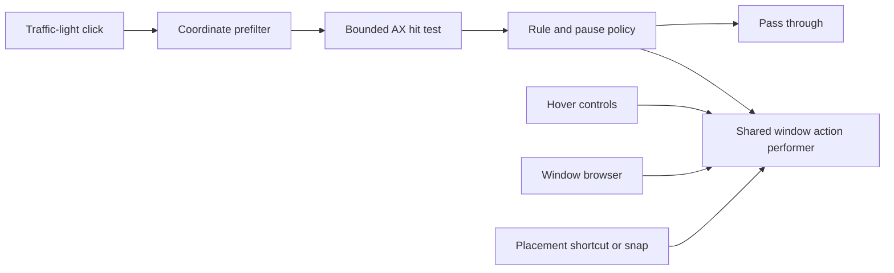

# Architecture

Blinker has two Swift Package targets: `BlinkerCore` owns rules and native window behavior; `BlinkerApp` owns application lifecycle, preferences and presentation. Core does not depend on the app target. It includes AppKit panels where native tracking, focus and glass composition are part of the behavior.

## Ownership

| Area | Responsibility |
|---|---|
| `BlinkerCore/Models` | Persisted rule/action value types and compatible decoding |
| `BlinkerCore/RuleEngine` | Rule lookup, independent remap/hover policies, session pause, transfer and undo |
| `BlinkerCore/AXInterceptor` | Input filtering, AX queries, shared window actions, layout history, optional snapping and workspaces |
| `BlinkerCore/HoverOverlay` | Hover detection, geometry, click protection, presentation state and native controls |
| `BlinkerCore/WindowBrowser` | Window/tab identity, discovery, focus/Dock observation, thumbnails and preview geometry |
| `BlinkerCore/Permission` | Accessibility status, read-only compatibility checks and explicit test-window registration |
| `BlinkerApp/ApplicationRules` | Application library, rule list, rule editor and rule file UI |
| `BlinkerApp/Settings` | Global settings, experimental workspace UI, About and diagnostics UI |
| `BlinkerApp/Permissions` | Shared authorization state, explicit requests, system-settings links and the current-app drag assistant |
| `BlinkerApp/WindowBrowser` | Browser preferences, Option-Tab handling and SwiftUI preview content |
| `BlinkerApp/WindowManagement` | Global placement shortcuts and recording |
| `BlinkerApp/AppWindowController` | Shared lifecycle for native settings, rule-list and per-app editor windows |
| Other `BlinkerApp` controllers | Menu bar, interception coordination and failure feedback |

Rules answer “what should happen for this app?” Settings answer “how should Blinker behave globally?” About identifies the product and links to help, feedback and licensing. Do not repeat feature catalogs or configuration controls across these surfaces.

## Execution boundaries

| Context | Work | Constraints |
|---|---|---|
| Event-tap thread | Coordinate filtering and synchronous bounded AX hit testing | Must decide whether to consume input; no capture, disk I/O or unbounded discovery |
| Serial AX workers | Hover/window discovery and action execution | AX messaging timeouts, bounded traversal and retained target identities |
| Main thread / `MainActor` | AppKit/SwiftUI state, panels, preferences and permission UI | UI updates only; consume worker results rather than scanning during view rendering |
| Thumbnail task | Asynchronous ScreenCaptureKit requests | One batch in flight; session checks before publishing results |

Click hit testing is partly synchronous because the original event must be passed through or consumed before the callback returns. Do not describe the tap as AX-free. Actions execute on a worker queue; the shared performer serializes mutations. An AX timeout limits an individual call, not the sum of every call in a traversal.

Hover movement is coalesced to at most 60 detection passes per second. Discovery uses a serial worker; AppKit mutations return to the main thread. `OverlayPresentationState` protects pending/displayed state with a lock and invalidates stale detections with a revision. Appearance delay (`OverlayWakeGate`) and click protection (`OverlayClickGate`/dwell controls) remain separate policies.

## Input to action

Unconfigured enhanced clicks do not silently become ordinary-left-click actions. Per-app `isEnabled` controls remapping and `isHoverEnabled` controls enlargement independently. Session pauses override both without rewriting saved preferences. Pausing globally suspends hotkeys while preserving their saved enabled state.

All action entry points use `DefaultWindowActionPerformer.shared`. Action targets retain a PID and AX element; neither window title nor current rectangle is an identity. Screenshot matching is separate and cannot redirect an action. Failures are reported through `ActionFeedback` to a transient nonactivating panel and the General diagnostics section. An accepted Quit request still allows the target app to ask about unsaved changes.

## Presentation and layout

One nonactivating `NSPanel` hosts the hover controls. A continuous capsule tray fills gaps and outer padding; the glass effect container groups button materials and does not replace that tray. macOS 26+ uses `NSGlassEffectView` and `NSGlassEffectContainerView`; older systems use `NSVisualEffectView`. Native buttons retain tracking and accessibility behavior. Reduced transparency/high contrast use the supported opaque fallback.

Hover geometry uses AX/CG coordinates with a top-left origin and converts using `AXQuery.coordinatePivotY`. The full tray is constrained to the intersection of its owner window and screen; the settings preview shares the geometry policy. Screens are read on the main thread. Window placement validates writes and keeps constrained or restored windows reachable.

`WindowBrowserPresentation` owns the preview panel and reuses its hosting view across sessions. The controller owns selection and behavior; stable session ordering is assembled by identity in linear passes. Preview panels have their own geometry. Scale affects content and frame together, while grid layout fits the available display. [Window browser](WINDOW_BROWSER.md) owns the details; do not duplicate layout rules in the settings preview or controller.

Application-library metadata scanning is separate from picker rendering. Resolve app icons on demand with a bounded cache; do not load every icon during a library scan. Rule file UI delegates bounded reads and validation to the transfer layer, with file I/O off the main thread.

## Persistence and bounds

| State | Lifetime and boundary |
|---|---|
| Rules | Local persisted values; compatible decoding and bounded undo/redo |
| Rule transfer | Versioned, validated JSON; merge by app ID as one undoable edit |
| Session pause | Temporary override, separate from saved enabled flags |
| Layout history | Successful changes only; up to 10 per window and 128 windows per run |
| Thumbnail cache | In memory; cost/count limits, bounded visible-image references, cleared on explicit disable or detected permission loss |
| Workspace layouts | Local persisted experimental data; preserve when the experiment is disabled |

Rule import must bound file reads before decoding, reject unsupported/invalid archives without partial edits, and preserve the original store on failure. Export excludes machine-specific permissions, thumbnail images and layout history. Legacy profile decoding remains only for migration.

Maximize and near-maximize toggle back when the current frame still matches the applied frame. Manual resizing starts a new operation. Restoring an old frame after a display disconnect clamps it to an available screen.

## Permission and failure policy

Accessibility enables window/control discovery and actions. Screen Recording is requested only by an explicit authorization action and is used for optional thumbnails. Settings and onboarding share one permission controller and the browser's thumbnail store. Checking status or returning to the app never requests access; explicit requests are limited to once per permission per process, with later attempts opening System Settings. Reauthorization provides guidance without resetting TCC or writing system preferences. The assistant exports the running app bundle's file URL, never a guessed installation or temporary copy. No app-managed thumbnail files, upload pipeline, analytics or automatic network requests are present. Project/help links intentionally open in the user's browser.

Missing permissions or unsupported controls must leave a usable fallback: icons and titles for missing capture access; ordinary windows for unsupported tab bars; feedback for an unavailable target. Pending work must not revive a dismissed panel or publish images into a later session. Keep user document/web content outside tab discovery.

Workspace restoration is the only explicit experiment using private Space APIs. Matching similar windows is approximate; unavailable symbols degrade to position restoration. It is not document/session restoration, and disabling its UI must not erase saved layouts or migration readers.

## Packaging boundary

`Scripts/package-app.sh` is shared by local and release builds. Callers must explicitly provide a non-empty `BLINKER_BUNDLE_ID`; an unset or empty value fails before writing output. The local wrapper supplies `com.ygnstudio.Blinker.dev`, and release CI supplies `com.ygnstudio.Blinker`, keeping development and release app registration, preferences and permission grants separate.

The packager rejects non-`.app` output paths, symlink outputs and an existing bundle with a different identity. Build in a temporary sibling directory, validate the property list and signature, then replace the installed bundle. Do not erase an existing installation before a candidate is verified or silently fall back after a requested signature fails.

## Verification

Use the commands in [Contributing](../CONTRIBUTING.md). Tests cover rule compatibility, imports, pause policy, geometry, history, target selection, capture matching and asynchronous presentation state. Native UI validation covers focus, permissions, real mouse travel, multiple displays, target-app AX differences and material appearance. Those checks complement tests; test counts and single-machine observations are not compatibility or performance guarantees.
